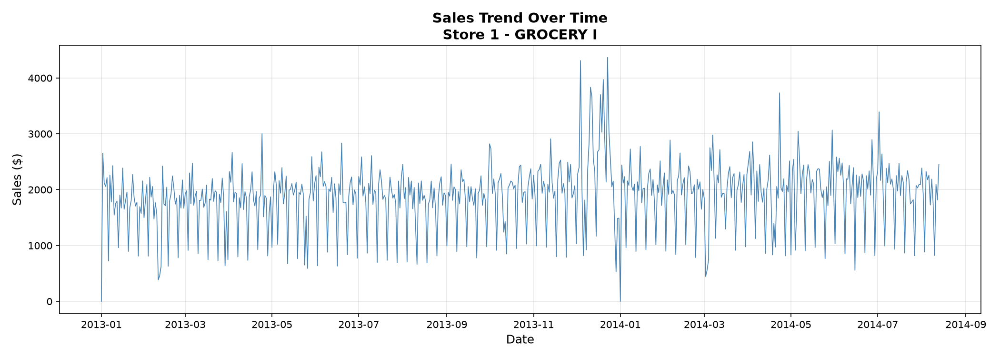
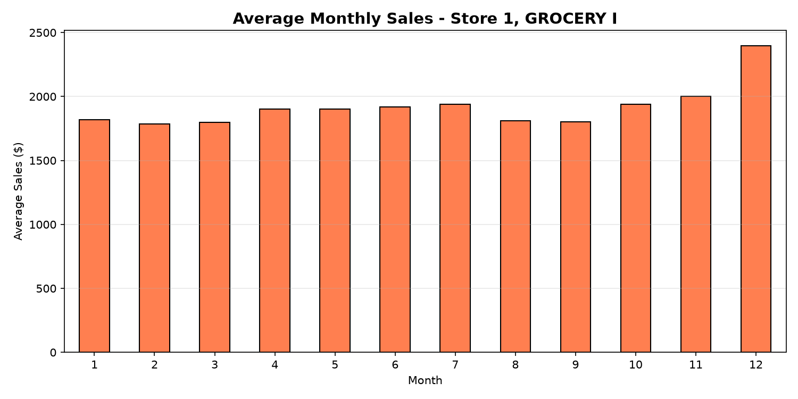
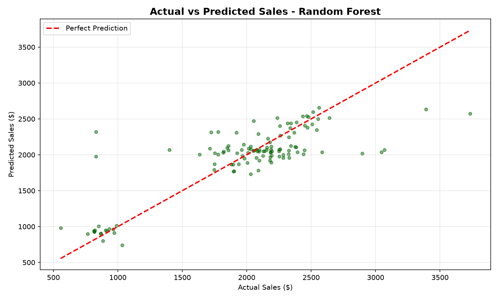
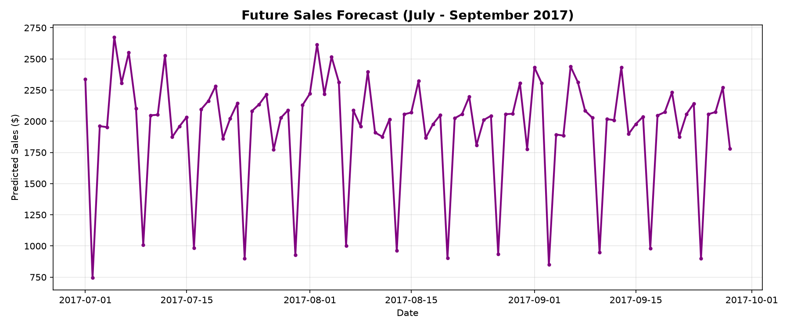

# 🚀 FUTURE_ML_01 — Sales & Demand Forecasting Using Machine Learning

> **Future Interns – Machine Learning Internship | Task 01**


---

## 📌 Project Overview

This project was developed as part of the **Future Interns Machine Learning Internship**.

The goal is to build an end-to-end **Machine Learning pipeline** capable of forecasting future sales using historical business data. The solution helps businesses anticipate customer demand, optimize inventory, improve staffing decisions, and support data-driven planning.

Rather than focusing only on model training, this project demonstrates the complete machine learning workflow from data preprocessing to business insights.

---

## 🎯 Objectives

* Clean and preprocess historical sales data
* Perform Exploratory Data Analysis (EDA)
* Engineer meaningful features
* Train multiple regression models
* Compare model performance
* Forecast future sales
* Generate business insights
* Save the best-performing model

---

# ⭐ Key Features

* ✅ End-to-End Machine Learning Pipeline
* ✅ Data Cleaning & Preprocessing
* ✅ Feature Engineering
* ✅ Exploratory Data Analysis (EDA)
* ✅ Time-Based Feature Extraction
* ✅ Linear Regression Model
* ✅ Random Forest Regressor
* ✅ Model Evaluation
* ✅ Future Sales Forecasting
* ✅ Business Insight Generation
* ✅ Professional Data Visualization
* ✅ Saved Trained Model

---

# 🧠 Machine Learning Pipeline

```text
Historical Sales Data
        │
        ▼
 Data Cleaning
        │
        ▼
 Feature Engineering
        │
        ▼
 Exploratory Data Analysis
        │
        ▼
 Train / Test Split
        │
        ▼
 Model Training
        │
        ▼
 Model Evaluation
        │
        ▼
 Best Model Selection
        │
        ▼
 Future Sales Prediction
        │
        ▼
 Business Insights
```

---

# 📂 Project Structure

```text
FUTURE_ML_01
│
├── data/
│   └── sales.csv
│
├── notebooks/
│   └── Task1_Sales_Forecasting.ipynb
│
├── src/
│   └── main.py
│
├── models/
│   └── sales_forecast_model.pkl
│
├── images/
│   ├── sales_trend.png
│   ├── monthly_sales.png
│   ├── actual_vs_predicted.png
│   └── future_forecast.png
│
├── reports/
│   └── future_sales_forecast.csv
│
├── requirements.txt
│
└── README.md
```

---

# 📊 Dataset

The dataset contains over **1 million historical sales records** collected from multiple stores and product categories.

| Feature     | Description         |
| ----------- | ------------------- |
| id          | Transaction ID      |
| date        | Sales Date          |
| store_nbr   | Store Number        |
| family      | Product Category    |
| sales       | Sales Value         |
| onpromotion | Promotion Indicator |

---

# 🛠 Tech Stack

| Category         | Technology          |
| ---------------- | ------------------- |
| Language         | Python              |
| Data Analysis    | Pandas, NumPy       |
| Visualization    | Matplotlib, Seaborn |
| Machine Learning | Scikit-Learn        |
| Notebook         | Jupyter             |
| IDE              | VS Code             |
| Model Storage    | Joblib              |

---

# 📈 Exploratory Data Analysis

The project analyzes historical sales using multiple visualizations including:

* Sales Trend
* Monthly Sales Distribution
* Actual vs Predicted Sales
* Future Sales Forecast

---

# 📷 Project Preview

### Sales Trend



---

### Monthly Sales



---

### Actual vs Predicted



---

### Future Sales Forecast



---

# ⚙ Feature Engineering

Additional features extracted from the **Date** column include:

* Year
* Month
* Day
* Day of Week
* Day of Year
* Promotion Status

These engineered features significantly improve predictive performance.

---

# 🤖 Machine Learning Models

| Model                   | Purpose                |
| ----------------------- | ---------------------- |
| Linear Regression       | Baseline Model         |
| Random Forest Regressor | Final Prediction Model |

---

# 📊 Model Performance

| Model             |        MAE |       RMSE |   R² Score |
| ----------------- | ---------: | ---------: | ---------: |
| Linear Regression |     393.85 |     503.06 |     0.2562 |
| **Random Forest** | **217.70** | **336.56** | **0.6671** |

🏆 **Best Model:** Random Forest Regressor

---

# 💼 Business Value

This project enables organizations to:

* 📦 Improve inventory management
* 📈 Forecast customer demand
* 👨‍💼 Optimize staffing decisions
* 💰 Reduce operational costs
* 🏪 Improve warehouse planning
* 📊 Support strategic business decisions

---

# 🚀 Getting Started

## 1️⃣ Clone Repository

```bash
git clone https://github.com/YOUR_USERNAME/FUTURE_ML_01.git
```

## 2️⃣ Open Project

```bash
cd FUTURE_ML_01
```

## 3️⃣ Install Dependencies

```bash
pip install -r requirements.txt
```

## 4️⃣ Run the Project

```bash
python src/main.py
```

Or launch the notebook:

```bash
jupyter notebook notebooks/Task1_Sales_Forecasting.ipynb
```

---

# 📦 Project Outputs

After running the project, the following files are generated:

* ✅ Trained Machine Learning Model
* ✅ Future Sales Forecast CSV
* ✅ Performance Metrics
* ✅ Prediction Charts
* ✅ Business Insights

---

# 🚀 Future Improvements

Potential enhancements include:

* XGBoost
* LightGBM
* CatBoost
* Facebook Prophet
* LSTM Deep Learning
* Flask API
* FastAPI Deployment
* Interactive Dashboard
* Docker Containerization
* Cloud Deployment

---

# 🎓 Skills Demonstrated

* Python Programming
* Data Cleaning
* Data Analysis
* Feature Engineering
* Exploratory Data Analysis
* Machine Learning
* Regression Modeling
* Model Evaluation
* Predictive Analytics
* Business Intelligence
* Data Visualization

---

# 👨‍💻 Author

**Abdi Negash**

Machine Learning Intern

**Future Interns**

**Track:** Machine Learning

**Task:** FUTURE_ML_01

**CIN:** FIT/JUN26/ML9423

---

# 🙏 Acknowledgements

Special thanks to **Future Interns** for providing an opportunity to gain practical experience in machine learning and predictive analytics through real-world projects.

---

## ⭐ If you like this project, consider giving it a star on GitHub!

This project demonstrates an end-to-end machine learning workflow and serves as a practical portfolio project for sales forecasting using Python and Scikit-Learn.
